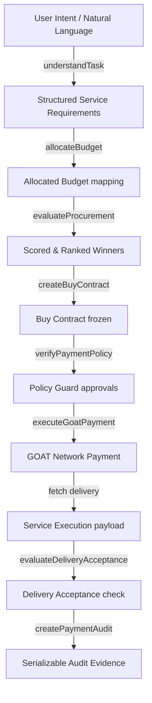

# System Architecture Document

MeterMind is built as a unified Vite + React + TanStack Start application that executes code across both client-side UI routes and server-side SSR execution environments.

---

## 1. Project Directory Structure

```
metermind-app/
├── docs/                      # Canonical documentation
├── src/
│   ├── components/            # Primitive UI buttons, stages, panels, and layouts
│   ├── routes/                # Page route handlers (TanStack Router)
│   │   ├── run-task.tsx       # Core procurement engine interactive UI
│   │   └── ...
│   ├── domain/                # Core offline-first business logic (tested in isolation)
│   │   ├── planning/          # Natural language intent parser, budget allocation
│   │   ├── procurement/       # Normalizer, qualification constraints, scoring
│   │   ├── payment/           # Buy Contract primitives, policy guard rules, audit
│   │   └── execution/         # Service orchestrator pipelines, acceptance criteria
│   ├── server/                # Secure server-side execution wrappers
│   │   ├── execution.ts       # Server function bridge registering live adapters
│   │   ├── payment/           # Ethers configurations, wallet keys, GOAT AgentKit adapters
│   │   └── providers/         # Live API gateways (CoinGecko, Bitfinex, Paid Research)
│   └── lib/                   # Shared types, error capture frameworks, test mocks
├── package.json               # Package declarations and tsx test validation scripts
└── tsconfig.json              # TypeScript compilation paths
```

---

## 2. High-Level Flow Chart

The MeterMind procurement workflow is split between deterministic offline planning and secure server-side live payment execution:



---

## 3. The 17-Step Target Lifecycle

1.  **Agent Request**: The autonomous agent or user submits a natural language task and budget constraint.
2.  **Intent Understanding**: Intent parser classifies the text into structural intent categories using deterministic rules.
3.  **Capability Requirements**: The intent category maps to a sequence of required capability categories (e.g. `web_search`, `summarization`, `translation`).
4.  **Provider Discovery**: The registry resolves all active candidate providers supporting the needed capabilities.
5.  **Provider Quotes**: MeterMind queries candidate providers for live pricing quotes.
6.  **Provider Telemetry**: Performance metrics (latencies, availability) are gathered.
7.  **ERC-8004 Trust/Reputation**: Historical success rates and reputation scores are evaluated.
8.  **Procurement Scoring**: Standardized prices, latencies, qualities, and reliabilities are normalized.
9.  **Winner Selection**: The scoring engine determines the highest scoring provider.
10. **Selection Explanation**: Deterministic explanations describe the rationale for selecting the winner and rejecting alternative candidates.
11. **Buy Contract**: Commercial parameters (cost, provider, network, acceptance criteria) are frozen in a signed hash.
12. **Policy Validation**: Immutability is verified, ensuring zero modifications were made post-authorization.
13. **x402 Payment**: Payer request triggers an HTTP 402 challenge.
14. **GOAT Settlement**: Payer signs the challenge and submits proof to settle the USDC balance.
15. **Service Execution**: The settled reference key unlocks the merchant API, executing the task.
16. **Delivery Acceptance**: The output payload is verified against the schema and keyword criteria.
17. **Procurement Receipt / Audit**: Audit files strip all keys and record complete transactional trace parameters.

---

## 4. Component Classification Matrix
 
MeterMind enforces strict integration classification boundaries:
 
| Component | Status | Description |
| :--- | :--- | :--- |
| **Intent Parser** | `REAL` | Keyword/constraint parsing under `src/domain/planning/understanding.ts` |
| **Budget Allocator** | `REAL` | Allocates step budgets under `src/domain/planning/budget.ts` |
| **Budget Ledger** | `REAL` | Thread-safe reservation ledger under `src/domain/procurement/budget-ledger.ts` |
| **Scoring / Normalizer** | `REAL` | Deterministic min-max scaler and tie-breaker under `src/domain/procurement/scoring.ts` |
| **Buy Contract primitive** | `REAL` | SHA-256 parameter hashing under `src/domain/payment/contract.ts` |
| **Budget & Policy Guards** | `REAL` | Strict validation limits under `src/domain/payment/policy.ts` |
| **Idempotency Protection** | `REAL` | Memory tables blocking double payment under `src/server/payment/simulated-x402-client.ts` |
| **Audit Logs** | `REAL` | Sanitizes mnemonics/private keys out of output traces under `src/domain/payment/audit.ts` |
| **GOAT AgentKit Client** | `BLOCKED` | Official SDK path exists but fails closed until Buy Contract, receiver, credentials, and durable idempotency prerequisites are present; no live payment proof yet |
| **CoinGecko Ingestion** | `REAL` | Authenticated live API price ingestion under `src/server/providers/coingecko.ts` |
| **Bitfinex Ingestion** | `REAL` | Public live API price comparison under `src/server/providers/bitfinex.ts` |
| **Paid Research execution** | `SIMULATED` | Default controlled local router; deterministic `sim_` evidence and demo execution mode |
| **Delivery Acceptance** | `REAL` | Schema/criteria validation and feedback preparation under `src/domain/execution/acceptance.ts` |
| **RPC Fallback list** | `REAL` | Rotates to backup RPC nodes on network timeout under `src/server/payment/wallet.ts` |
| **Auto Re-quoting** | `REAL` | Validates quote freshness and runs requote loop under `src/domain/procurement/requote.ts` |
| **ERC-8004 Identity/Reputation Reads** | `PARTIAL`| AgentKit read integration proven on GOAT Testnet3 for external agent 356; identity exists, feedback clients/score do not. Explicit mappings and provenance are required. |
| **ERC-8004 Feedback Preparation / Write** | `PARTIAL`| Production preparation exists; on-chain submission is `NOT IMPLEMENTED` and was not attempted. |
| **State Persistence** | `NOT IMPLEMENTED`| In-memory tables only (lacks persistent database) |
