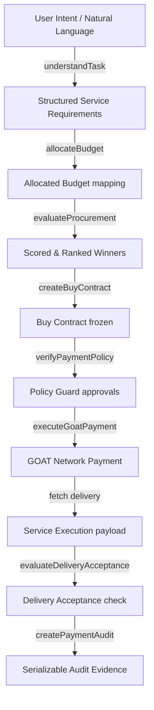

# MeterMind Architecture Map

This document tracks the execution status and architecture maturity of all MeterMind capabilities.

## High-Level Flow Chart

## Component Classification

Below is the classification of each capability within the MeterMind codebase:

| Component | Status | Evidence / File Path |
|---|---|---|
| **Intent Parser** | `REAL` | [`understanding.ts`](file:///c:/Users/PC/Desktop/METERMIND/metermind-app/src/domain/planning/understanding.ts) |
| **Service Requirements Resolver** | `REAL` | [`understanding.ts`](file:///c:/Users/PC/Desktop/METERMIND/metermind-app/src/domain/planning/understanding.ts) |
| **Budget Allocator** | `REAL` | [`budget.ts`](file:///c:/Users/PC/Desktop/METERMIND/metermind-app/src/domain/planning/budget.ts) |
| **Capability Matcher** | `REAL` | [`planner.ts`](file:///c:/Users/PC/Desktop/METERMIND/metermind-app/src/domain/planning/planner.ts) |
| **Provider Selection Scorer** | `REAL` | [`scoring.ts`](file:///c:/Users/PC/Desktop/METERMIND/metermind-app/src/domain/procurement/scoring.ts) |
| **Live Pricing / Quote Ingestion** | `PARTIAL` | [`coingecko.ts`](file:///c:/Users/PC/Desktop/METERMIND/metermind-app/src/server/providers/coingecko.ts) & [`bitfinex.ts`](file:///c:/Users/PC/Desktop/METERMIND/metermind-app/src/server/providers/bitfinex.ts) |
| **Winner Selection** | `REAL` | [`scoring.ts`](file:///c:/Users/PC/Desktop/METERMIND/metermind-app/src/domain/procurement/scoring.ts) |
| **Buy Contract primitive** | `REAL` | [`contract.ts`](file:///c:/Users/PC/Desktop/METERMIND/metermind-app/src/domain/payment/contract.ts) |
| **Budget / Policy Validation** | `REAL` | [`policy.ts`](file:///c:/Users/PC/Desktop/METERMIND/metermind-app/src/domain/payment/policy.ts) |
| **GOAT Network / AgentKit Payment** | `REAL` | [`goat-client.ts`](file:///c:/Users/PC/Desktop/METERMIND/metermind-app/src/server/payment/goat-client.ts) |
| **Wallet & Token Handling** | `REAL` | [`wallet.ts`](file:///c:/Users/PC/Desktop/METERMIND/metermind-app/src/server/payment/wallet.ts) |
| **Idempotency Protection** | `REAL` | [`policy.ts`](file:///c:/Users/PC/Desktop/METERMIND/metermind-app/src/domain/payment/policy.ts) |
| **Payment Timeout & Check** | `REAL` | [`goat-client.ts`](file:///c:/Users/PC/Desktop/METERMIND/metermind-app/src/server/payment/goat-client.ts) |
| **Service Execution Orchestration**| `REAL` | [`executor.ts`](file:///c:/Users/PC/Desktop/METERMIND/metermind-app/src/domain/execution/executor.ts) |
| **Paid Research execution** | `REAL` | [`paid-research-live.ts`](file:///c:/Users/PC/Desktop/METERMIND/metermind-app/src/server/providers/paid-research-live.ts) |
| **Delivery Verification & Acceptance**| `REAL` | [`acceptance.ts`](file:///c:/Users/PC/Desktop/METERMIND/metermind-app/src/domain/execution/acceptance.ts) |
| **Audit Evidence** | `REAL` | [`audit.ts`](file:///c:/Users/PC/Desktop/METERMIND/metermind-app/src/domain/payment/audit.ts) |
| **RPC Redundancy & Fallback** | `NOT IMPLEMENTED` | No fallback logic for GOAT Testnet3 RPC |

## Status Explanations

1. **Live Pricing**: Supported only for `market_data` category (via CoinGecko and Bitfinex). Other service categories (e.g., search, summarization) utilize static mock catalog entries.
2. **Buy Contract**: Freshly implemented as a backend primitive to enforce transaction immutability between authorization and final settlement.
3. **Delivery Acceptance**: Added to ensure paid services deliver outputs satisfying explicit contract schemas and constraints prior to final complete state.
4. **RPC Redundancy**: The system operates with a single RPC endpoint (`https://rpc.testnet3.goat.network`), making it vulnerable to rate limits and downtime.
