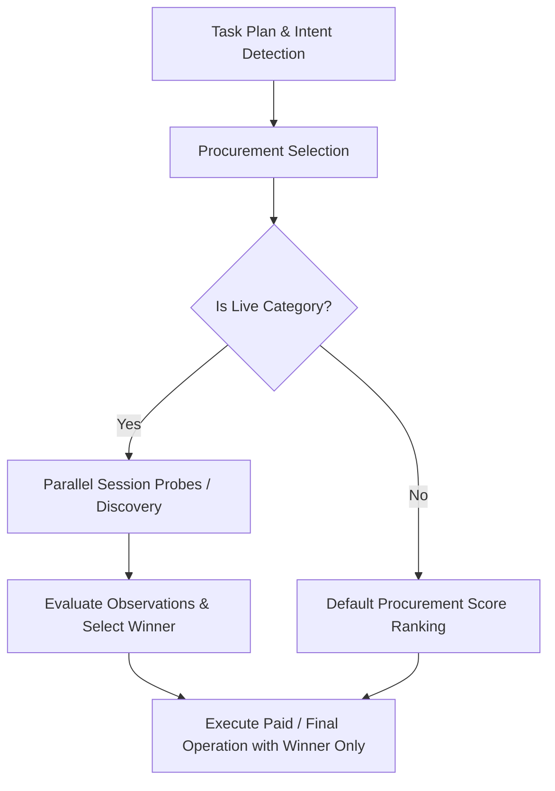

# Paid-Future Architecture Safety & Provider Discovery Design

This document details the architectural boundaries between provider **probe/discovery** (observation phase) and provider **execution** (paid/final operation phase).

## Core Architectural Boundary

The MeterMind procurement and execution pipeline distinguishes clearly between checking a provider's status/capabilities and executing the final transaction.

### 1. Probe & Discovery (Observation Phase)
- **Purpose**: To check provider availability, latency, and retrieve high-level session status without committing to high-cost or transactional execution.
- **Characteristics**: Fast, public, anonymous, or low-cost endpoints.
- **Constraints**: 
  - Discovery must **NOT** trigger payments, write operations, or consume expensive rate-limited resource tokens.
  - The architecture must assume that **not all candidates can be fully executed** prior to provider selection.
  - Probes must be safe to run in parallel across multiple candidate providers.

### 2. Final Execution (Paid Phase)
- **Purpose**: To retrieve the final, high-fidelity result or execute the transaction with the single selected provider.
- **Characteristics**: Uses private API keys, consumes user credits/budgets, and may execute paid transactions.
- **Constraints**:
  - Only executed on the **winner** of the selection phase.
  - Blocks other candidate executions to prevent unnecessary financial spend.

## Dual-Use Case: Public Financial Feeds

For current public quote providers (like CoinGecko and Bitfinex), a single HTTP request serves a dual purpose:
1. **Probe/Observation**: It measures current session latency and validates quote freshness.
2. **Result Compilation**: Since public quotes are free and stateless, the retrieved data *is* the final execution result.

### How the Architecture Handles This
Even though the data is reused to optimize latency and minimize API roundtrips, the orchestration layer enforces separation:
- The executor invokes parallel status probes.
- Once the winner is selected based on observed session metrics (latency, data validity), the execution result payload is populated directly from that provider's observation.
- For future transactional or paid services (e.g., paid LLM queries, database operations, payment processing), the status check will be a cheap health check/metadata call, and the actual paid query will only be sent to the winner after selection is complete.
